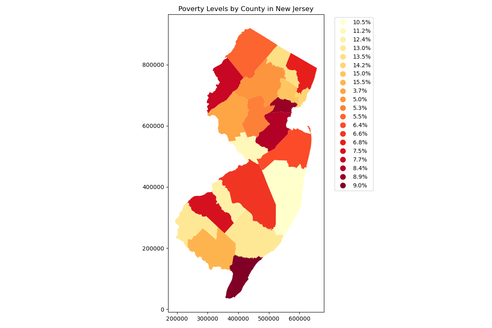
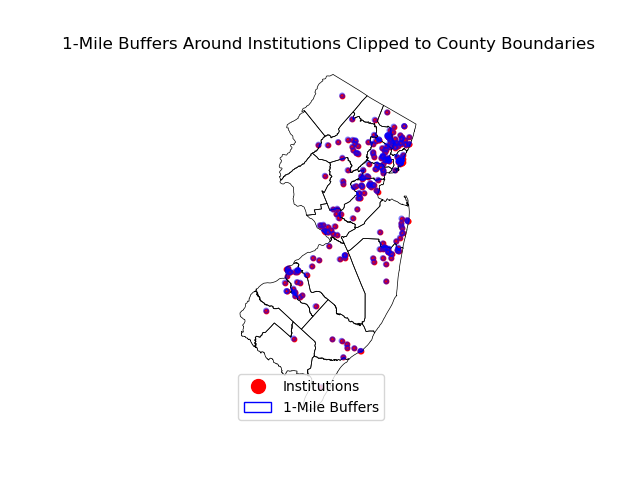

# Spatial Analysis of Career and Technical Education in New Jersey
**Author:** Zarak Khan  
**Course:** 34:816:651:90 SEMINAR IN PUBLIC INFORMATICS  

---

## **Project Scope**  
This project explores the relationship between socioeconomic factors, population density, and accessibility to accredited career and technical institutions across New Jersey counties. Using static and interactive maps, the project aims to answer the following key questions:

- How are accredited career and technical institutions distributed across counties in New Jersey?  
- What is the relationship between population density and the accessibility of these institutions?  
- How does the distribution of institutions correlate with socioeconomic indicators such as poverty rates?  
- Which areas are underserved by the current distribution of institutions based on proximity, population, and socioeconomic needs?  

The goal of this project is to provide insights into spatial equity in educational access and its relationship to broader socioeconomic challenges, with potential implications for policy and planning.

---

## **Static Maps**  

### **Poverty Levels by County**  
  
This map visualizes the percentage of people living below the poverty line across New Jersey counties. The data was sourced from the American Community Survey (ACS) 5-Year Estimates (2018–2022). Counties with higher poverty rates are highlighted, providing context for assessing educational accessibility.  

### **Institution Accessibility and Buffers**  
  
This map highlights career and technical institutions with 1-mile buffer zones clipped to county boundaries. The visualization helps assess the immediate accessibility of these institutions and identifies areas that lack nearby facilities.

---

## **Interactive Map**  

### **Institutions and Poverty Levels Interactive Map**  
Explore the interactive map below to view institution locations, poverty levels, and accessibility buffers:  
[Interactive Map](interactive_map.html)  

This map shows the location of accredited career and technical institutions overlaid with county poverty levels as a choropleth. Users can hover over institutions for details, including name, address, and contact information. The map also allows toggling between layers to explore correlations with population density and socioeconomic factors.

---

## **Data Sources**  

### **County Boundaries**  
- **Source:** [New Jersey Geographic Information Network (NJGIN)](https://www.nj.gov/njgin/edata/boundaries/index.html)  
- **Prepared By:** NJ Office of Information Technology, Office of GIS (NJOGIS)  
- **Description:** This dataset provides accurate county boundaries and was used as the base geography for all analyses.  

### **Career and Technical Institutions**  
- **Source:** [data.nj.gov](https://data.nj.gov/)  
- **Prepared By:** New Jersey State Government  
- **Description:** This dataset includes the location and attributes of accredited career and technical institutions. Latitude and longitude coordinates were verified for spatial mapping.  

### **Poverty Data**  
- **Source:** [American Community Survey (ACS) 5-Year Estimates (2018–2022)](https://data.census.gov/table/ACSST5Y2022.S1701?q=Income%20and%20Poverty&g=040XX00US34$0500000)  
- **Prepared By:** U.S. Census Bureau  
- **Description:** Poverty statistics, including total population, individuals below the poverty level, and percent below poverty, were extracted and cleaned to align with county boundaries.  

---

## **Analysis and Methodology**  

### **Poverty Levels by County**  
Poverty data was processed and merged with county boundary data. A thematic map was created to visualize poverty levels, with counties symbolized by the percentage of the population living below the poverty line.  

### **Institution Accessibility**  
Institution locations were filtered to include only those within New Jersey and spatially joined with county data. Buffers of 1 mile were created around each institution to visualize accessibility and clipped to county boundaries for better spatial representation.  

### **Buffer Analysis**  
A buffer analysis was conducted to highlight underserved areas, focusing on proximity to institutions. Counties with limited or no buffer overlap were identified as potential underserved regions.  

### **Heatmap and Interactive Layers**  
An interactive map was developed using Folium, incorporating layers for institution locations, poverty levels, and a heatmap of institution density. Tooltips and pop-ups provide additional context, making the map informative and engaging.  

---

## **Key Findings and Insights**  

- **Institution Distribution and Poverty**: Counties with high number of institutions, such as Essex, Hudson, and Passaic, generally show higher poverty rates. This could be due to factors such as population density and cost of living in these areas.  
- **Underserved Regions**: Rural counties with fewer institutions often exhibit lower poverty rates but may lack sufficient access to educational resources.  
- **Policy Implications**: The findings suggest the need for targeted expansion of career and technical education infrastructure in underserved areas and further exploration of socioeconomic barriers in urban counties with high poverty levels.

---

## **About the Project**  
This project was created as part of the **34:816:651:90 SEMINAR IN PUBLIC INFORMATICS** course and reflects efforts to use geospatial data and mapping tools for public policy analysis and decision-making.

